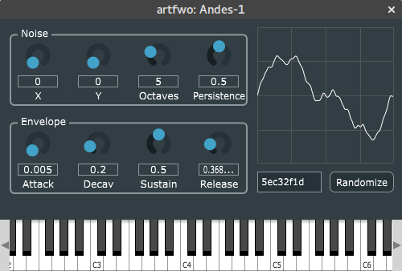

Andes is a software synthesiser plugin in early stages of development.
The core of Andes is an original oscillator which uses a pseudo-3D version of
[Perlin noise](https://en.wikipedia.org/wiki/Perlin_noise) to produce distinctively digital sound.

# download

* Windows [64-bit](https://github.com/artfwo/andes/releases/download/v0.2/Andes1-v0.2-win64.zip) / [32-bit](https://github.com/artfwo/andes/releases/download/v0.2/Andes1-v0.2-win32.zip) (VST / Standalone)
* Linux [64-bit](https://github.com/artfwo/andes/releases/download/v0.2/Andes1-v0.2-linux64.tar.gz) / [32-bit](https://github.com/artfwo/andes/releases/download/v0.2/Andes1-v0.2-linux32.tar.gz) (VST / Standalone)
* MacOS [universal](https://github.com/artfwo/andes/releases/download/v0.2/Andes1-v0.2-mac.zip) (VST / AU / Standalone)
* [Source code](https://github.com/artfwo/andes)

The oscillator is still a work in progress so please keep in mind that
things may break with future versions. Do not use this plugin in production. :)

Andes is free software distributed under GPLv3 license, see the included LICENSE file for details. 

Please send suggestions, issues and/or patches via [Github](https://github.com/artfwo/andes) or directly to `art at artfwo dot net`.
